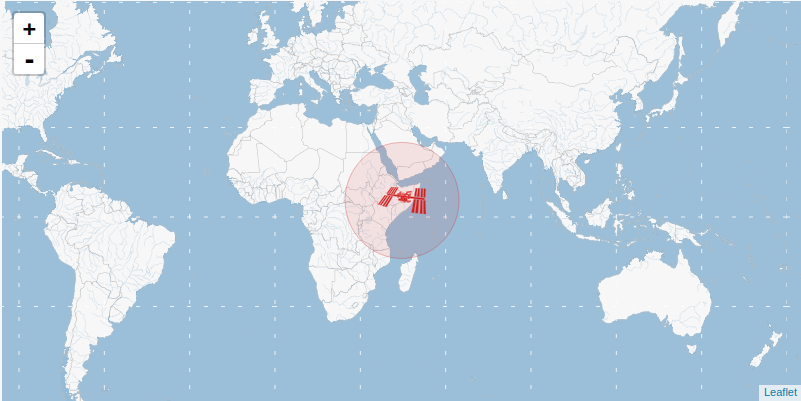

Intro
--------------------------------------------------------------------------------

Bibliothèque standard, PyPi.

(Système de) fichiers
--------------------------------------------------------------------------------

`pathlib` plus ce qui peux manquer et qui est présent dans les autres libs
(`shutil`, etc.)

`gzip` ?

OS, CLI, Terminal, SSH
--------------------------------------------------------------------------------

`time`, `sys`

`sys.argv` -> `argparse` -> `click` ou `typer`.

`subprocess` -> `plumbum`

`paramiko` ?

`e-mail` ? Study <https://realpython.com/python-send-email/>

### Comment invoquer un programme en ligne de commande depuis Python ?


Web
--------------------------------------------------------------------------------

### `http.server`

📖 [Documentation](https://docs.python.org/3/library/http.server.html)

``` python
import http.server

# Answer to all TCP traffic on port 8000:
server_address = ("", 8000)  
Handler = http.server.SimpleHTTPRequestHandler

with http.server.HTTPServer(server_address, Handler) as httpd:
    httpd.serve_forever()
```

### `webbrowser`

📖 [Documentation](https://docs.python.org/3/library/webbrowser.html)

``` python
import webbrowser
webbrowser.open("https://www.python.org")
```


### 🌍 Comment obtenir la position de la station spatiale internationale ?

Le site [Open Notify](http://open-notify.org/) fournit cette information en 
temps-réel à travers une interface Web (de type [REST]). 
Le package [requests] permet d'exploiter le protocole associé, 
[HTTP].

[REST]: https://fr.wikipedia.org/wiki/Representational_state_transfer
[requests]: https://docs.python-requests.org/en/latest/
[HTTP]: https://developer.mozilla.org/fr/docs/Web/HTTP

``` python
>>> import requests
>>> URL = "http://api.open-notify.org/"
>>> r = requests.get(f"{URL}/iss-now.json")
>>> r.json()
{'message': 'success', 'iss_position': {'longitude': '41.4552', 'latitude': '0.9816'}, 'timestamp': 1641661775}
```




-----

  - `http.server`

  - `urllib` -> `requests`

  - framework : `flask`, `django`

Formats de sérialization
--------------------------------------------------------------------------------

  - `json`

  - `xml` (/html) ; `etree` et `lxml`

  - `pyyaml` et `strictyaml`

GUI
--------------------------------------------------------------------------------

  - `pyqt`, `pygtk`, etc.?

FFI
--------------------------------------------------------------------------------

  - `ctypes`, `cffi`

  - `cython`.