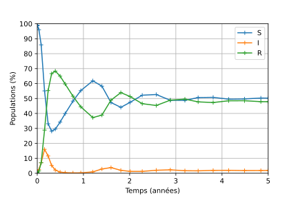
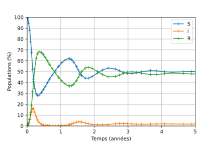
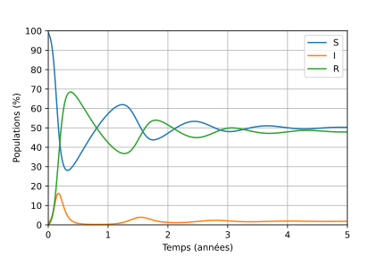
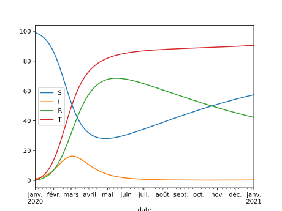
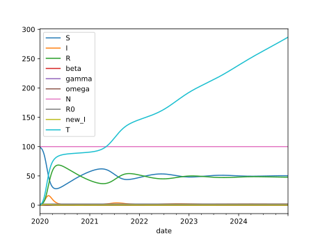
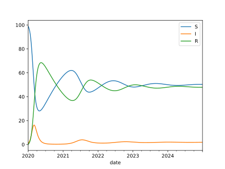
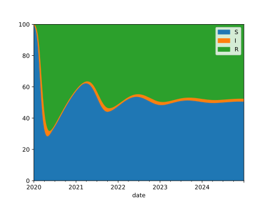
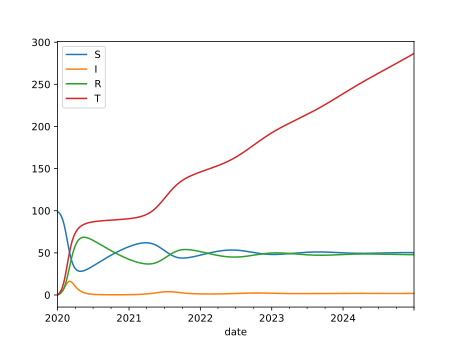
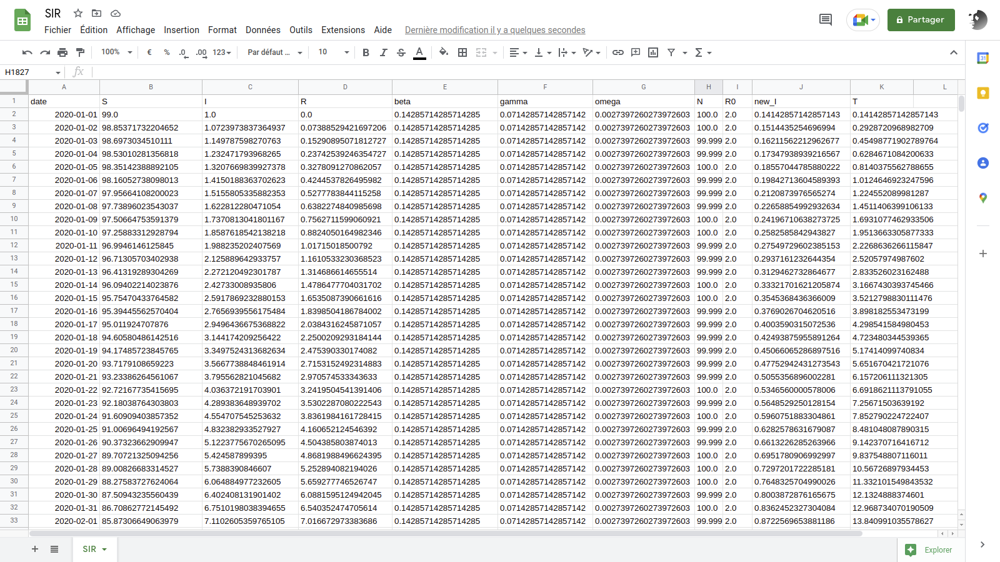

## Introduction

Le modèle épidémiologique à compartiments SIR détermine 
l'évolution dans le temps, parmi une population supposée constante de
$N$ individus, du nombre d'individus susceptibles d\'être infectés $S$,
du nombre d'individus infectés $I$ et du nombre d'individus en
rémission (n'ayant plus de symptômes cliniques) $R$ (cf. ["The SEIRS
model for infectious disease
dynamics"](https://www.nature.com/articles/s41592-020-0856-2) pour la
présentation d'un modèle plus complet).

Le paramètre $\beta>0$ représente le taux de contagion, $\gamma>0$ le
taux de guérison et $\omega>0$ le taux de perte d'immunité (ces
grandeurs sont homogènes à l'inverse d\'un temps). On définit le nombre
de reproduction de base $R_0$ par

$$
R_0 := \frac{\beta}{\gamma}
$$

En l\'absence de naissances et de morts, ces grandeurs évoluent selon
les équations :

$$
\dot{S}(t) = \omega R(t) - \beta \frac{I(t)S(t)}{N} 
$$

$$
\dot{I}(t) = \beta \frac{I(t)S(t)}{N} - \gamma  I(t) 
$$

$$
\dot{R}(t) = \gamma I(t) - \omega R(t)
$$


## Dépendances

Python 3, NumPy, SciPy, Matplotlib.

``` python
from numpy import *
from scipy.integrate import solve_ivp
import matplotlib.pyplot as plt
```

## Simulation


On définit les constantes

``` python
WEEK = 7
YEAR = 365
```

et

``` python
N = 100
beta = 1 / (WEEK)
gamma = 1 / (2 * WEEK)
omega = 1 / YEAR
```

#### 🚀 Simulation avec `solve_ivp`

Développer une fonction `dSIR` telle que le code 

``` python
S0, I0 = 99.0, 1.0
R0 = N - S0 - I0
t_span = [0.0, 5*YEAR]
results = solve_ivp(dSIR, t_span=t_span, y0=(S0, I0, R0))
```

fournisse les résultats d'une simulation du modèle SIR sur 5 ans 
avec une population initiale de 1 % de personnes infectées.

(Référence : 📖 [`solve_ivp`](https://docs.scipy.org/doc/scipy/reference/generated/scipy.integrate.solve_ivp.html))

<details>
<summary>
#### ✨ Solution
</summary>


``` python
def dSIR(t, SIR):
    S, I, R = SIR
    dS = omega * R - beta * I * S / N
    dI = beta * I * S / N - gamma * I
    dR = gamma * I - omega * R  
    return (dS, dI, dR)
```

Si vous êtes familier des fermetures,
et que la présence d'un argument `t` "qui ne sert à rien" vous titille,
vous pouvez également définir la fonction d'ordre supérieur

``` python
def autonomous(fx):
    def f_tx(t, x):
        return fx(x)
    return f_tx
```

et l'exploiter comme un décorateur pour définir `dSIR` sans le paramètre `t` :

``` python
@autonomous
def dSIR(SIR):
    S, I, R = SIR
    dS = omega * R - beta * I * S / N
    dI = beta * I * S / N - gamma * I
    dR = gamma * I - omega * R  
    return (dS, dI, dR)
```

</details>

## Visualisation

#### 🚀 Visualisation des résultats

Développez une fonction `plot` à invoquer par :

``` python
plot(**results)
```

qui produise le graphique :



<details>
<summary>
#### ✨ Solution
</summary>


Les données dont nous avons besoin dans le dictionnaire `results` sont
associées aux clés `"t"` et `"y"`. Si elles étaient les seules données
présentes dans `results`, nous pourrions définir une fonction `plot`
de signature :

``` python
def plot(t, y):
    pass
```

et l'appel `plot(**results)` assignerait aux paramètres `t` et `y` les
données correspondantes de `result`. Mais en pratique, `results` contient
d'autre données :

``` python
>>> list(results.keys())
['t', 'y', 'sol', 't_events', 'y_events', 'nfev', ...]
```

Or à ce stade notre fonction n'accepte pas les paramètres nommés
`sol`, `t_events`, etc. L'appel à `plot` échoue donc logiquement :

``` python
>>> plot(**result)
Traceback (most recent call last):
...
TypeError: plot() got an unexpected keyword argument 'sol'
```

Une façon de changer cette situation est d'introduire un "ramasse-miettes", 
sous la forme d'un dictionnaire collectant les données de`result` qui ne sont 
pas associées aux clés `"t"` ou `"y"`. Pour ce faire, la notation `**` est
utilisée ; le dictionnaire associé est ici nommé `_` pour indiquer 
qu'on ne fera pas usage de son contenu (cela n'est pas obligatoire, juste
une convention).

``` python
def plot(t, y, **_):
    print(list(_.keys()))
```

``` python
>>> plot(**results)
['sol', 't_events', 'y_events', ...]
```

Avec cette technique, la fonction suivante fait l'affaire :

``` python
def plot(t, y, **_):
    plt.plot(t, y.T, "-+", label=["S", "I", "R"])
    plt.xlabel("Temps (années)")
    xlabels = [str(i) for i in range(5+1)]
    plt.xticks(arange(0, 5*YEAR+1, YEAR), xlabels)
    plt.ylabel("Populations (%)")
    plt.yticks(arange(0, 101, 10))
    plt.axis([0, 5*YEAR, 0, 100])
    plt.legend()
    plt.grid(True)
```

</details>

## Configuration

Après examen de vos résultats préliminaires, les spécialistes de la dynamique
vous font part de réglages à effectuer sur la méthode du simulation.
Leurs préconisations prennent la forme d'un fichier `options.py` à
utiliser avec `solve_ivp` :

``` python
{
    "method": "Radau",
    "rtol": 1e-3,
    "atol": 1e-6
}
```

#### 🚀 Réglages

Prenez en compte le fichier d'options que l'on vous a donné.

<details>
<summary>
#### ✨ Solution
</summary>

``` python
options = eval(open("options.py").read())
results = solve_ivp(
    dSIR, 
    t_span=t_span, 
    y0=(S0, I0, R0), 
    **options
)
```



</details>


## Temps continu

Lorsque `solve_ivp` est invoqué avec `dense_output=True`

``` python
results = solve_ivp(
    dSIR, 
    t_span=t_span, 
    y0=(S0, I0, R0), 
    dense_output=True
)
```

ses résultats comportent, en plus des données discrètes `t` et `y`,
une approximation de la solution comme une fonction du temps.

``` python
>>> sol = results["sol"]
```

Cette fonctionalité nous permet de réaliser une nouvelle version de
la fonction `plot`, telle que :

``` python
>>> t = arange(0, 5*YEAR) # a value every day for 5 years.
>>> plot(t, **results)
```

produise le graphique :




#### 🚀 Exploitation des "dense outputs"

Vérifier que `sol` est invocable, puis développer une nouvelle version de la
fonction `plot` exploitant les "dense outputs" de `solve_ivp` pour réaliser
le graphe voulu. 

<details>
<summary>
#### ✨ Solution
</summary>

``` python
>>> sol = results["sol"]
>>> sol
<scipy.integrate._ivp.common.OdeSolution at ...>
>>> callable(sol)
True
```

``` python
def plot(t_, sol, **_):
    plt.plot(t_, sol(t_).T, "-", label=["S", "I", "R"])
    plt.xlabel("Temps (années)")
    xlabels = [str(i) for i in range(5+1)]
    plt.xticks(arange(0, 5*YEAR+1, YEAR), xlabels)
    plt.ylabel("Populations (%)")
    plt.yticks(arange(0, 101, 10))
    plt.axis([0, 5*YEAR, 0, 100])
    plt.legend()
    plt.grid(True)
```

</details>

## Evènements

#### 🚀 Seuils d'infection

Utiliser le paramètre `events` de `solve_ivp` pour détecter les instants
où le nombre d'infectés passe en-dessous ou au-dessus de 10 %. 
Adapter une nouvelle fois la fonction `plot` pour représenter ces évènements
comme des points noirs sur la courbe associée à la variable $I$.


Comment réorganiser votre programme pour prendre en charge facilement un
seuil d'infection arbitraire et non pas fixe à 10 % ?

<details>
<summary>
#### ✨ Solution
</summary>


``` python
def event(t, SIR):
    S, I, R = SIR
    return I - 10.0
```

``` python
results = solve_ivp(
    dSIR, 
    y0=(S0, I0, R0), 
    t_span=t_span, 
    dense_output=True, 
    events=[event]
)
```

``` python
def plot(t_, sol, t_events, **_):
    plt.plot(t_, sol(t_).T, "-", label=["S", "I", "R"])
    t_event = t_events[0]
    plt.plot(t_event, sol(t_event)[1], "k.")
    plt.xlabel("Temps (années)")
    xlabels = [str(i) for i in range(5+1)]
    plt.xticks(arange(0, 5*YEAR+1, YEAR), xlabels)
    plt.ylabel("Populations (%)")
    plt.yticks(arange(0, 101, 10))
    plt.axis([0, 5*YEAR, 0, 100])
    plt.legend()
    plt.grid(True)
```

La solution "évidente" pour prendre en charge une seuil limite qui peut varier
est d'utiliser une variable globale :

``` python
I_max = 2.0

def event(t, SIR):
    S, I, R = SIR
    return I - I_max
```

L'avantage est que le code appelant la simulation est inchangé :

``` python
results = solve_ivp(
    dSIR, 
    y0=(S0, I0, R0), 
    t_span=t_span, 
    dense_output=True, 
    events=[event]
)
```

``` python
>>> plot(t, **results)
```


Si vous n'aimez pas beaucoup les variables globales, vous pouvez les éviter
en utilisant une fonction d'ordre supérieur qui renvoie une fonction `event` :

``` python
def I_crosses(I_threshold):
    def event(t, SIR):
        S, I, R = SIR
        return I - I_threshold
    return event
```

Vous l'exploitez alors de la façon suivante :

``` python
results = solve_ivp(
    dSIR, 
    y0=(S0, I0, R0), 
    t_span=t_span, 
    dense_output=True, 
    events=[I_crosses(2.0)]
)
```

avec les mêmes résultats que précédemment

</details>


## Généralisation

Vous avez sans doute remarqué que la dynamique du modèle SIR est entièrement
déterminée par les flux existant entre les "compartiments" de population
$S$, $I$ et $R$, qui peuvent être décrits par la structure :

``` python
SIR_dynamics = {
 ("S", "I"): "beta * I * S / N",
 ("I", "R"): "gamma * I",
 ("R", "S"): "omega * R"
}
```

Au lieu d'écrire "à la main" la fonction `dSIR` comme précédemment, 
on peut définir une fonction `make_d_state` qui prend comme argument
le type de dictionnaire ci-dessus et produit automatiquement la fonction
`dSIR_auto`[^why] :

[^why]: On peut ainsi éviter les erreurs dans la traduction du modèle de 
flux en équations différentielles, définir plus rapidement de nouveaux
modèles compartimentaux, etc.

``` python
dSIR_manu = dSIR
dSIR_auto = make_dstate(SIR_dynamics)
```

#### 🚀 Création du champ de vecteurs de la dynamique

Implémenter la fonction `make_dstate`. 
On vérifiera que les comportements de la version manuelle et automatique sont
identiques. Par exemple :

``` python
>>> dSIR_manu(0.0, (1/3, 1/3, 1/3))
(0.0007545118504022613, -0.023650793650793648, 0.02289628180039139)
>>> dSIR_auto(0.0, (1/3, 1/3, 1/3))
(0.0007545118504022613, -0.023650793650793648, 0.02289628180039139)
```

<details>
<summary>
#### ✨ Solution
</summary>


``` python
def get_vars(dynamics):
    vars = []
    for pair in dynamics.keys():
        vars.extend(pair)
    # remove duplicated vars
    return list(set(vars))
```

``` python
>>> get_vars(SIR_dynamics)
['S', 'I', 'R']
```

``` python
def make_dstate(dynamics):
    vars = get_vars(dynamics)
    
    def fun(t, state):
        ns = globals().copy()
        for var, value in zip(vars, state):
            ns[var] = value
        dstate = []
        for var in vars:
            d = 0
            for (edge, expr) in dynamics.items():
                source, target = edge
                if source == var:
                    d -= eval(expr, ns)
                if target == var:
                    d += eval(expr, ns)
            dstate.append(d)
        return dstate
        
    return fun 
```

</details>


# Tableaux

On reproduit ici l'intégralité du code qui permet de générer la séquence des 
valeurs journalières de $S$, $I$ et $R$ pendant les 5 premières années de 
l'épidémie :

```python
from numpy import *
from scipy.integrate import solve_ivp

WEEK = 7
YEAR = 365
beta = 1 / (WEEK)
gamma = 1 / (2 * WEEK)
omega = 1 / YEAR

N = 100
S0, I0 = 99.0, 1.0
R0 = N - S0 - I0

def dSIR(t, SIR):
    S, I, R = SIR
    dS = omega * R - beta * I * S / N
    dI = beta * I * S / N - gamma * I
    dR = gamma * I - omega * R  
    return (dS, dI, dR)

t_span = [0.0, 5*YEAR]

results = solve_ivp(
    dSIR, 
    y0=(S0, I0, R0), 
    t_span=t_span, 
    dense_output=True, 
)

t = arange(0, 5*YEAR)
S, I, R = results["sol"](t)
```

#### 👶 Création

Créez un **tableau de données** (🇺🇸 **dataframe**) [pandas] stockant les valeurs
journalières de $S$, $I$ et $R$ dans des colonnes de même nom. Ajoutez ensuite
les colonnes des valeurs (constantes dans notre modèle) $\beta$, $\gamma$
et $\omega$ ; on nommera les colonnes correspondantes `beta`, `gamma` et `omega`.
Afficher un résumé du tableau avant et après cet ajout.

[pandas]: https://pandas.pydata.org/

📖 : [`DataFrame`](https://pandas.pydata.org/docs/reference/api/pandas.DataFrame.html) (pandas)

<details>
<summary>
#### ✨ Solution
</summary>

```python
>>> import pandas as pd
>>> df = pd.DataFrame({"S":S, "I": I, "R": R})
>>> df # doctest: +ELLIPSIS
              S         I          R
0     99.000000  1.000000   0.000000
1     98.853717  1.072397   0.073885
2     98.697303  1.149788   0.152909
3     98.530103  1.232472   0.237425
4     98.351424  1.320767   0.327809
                      ...
1820  50.279454  1.851949  47.868597
1821  50.277556  1.852686  47.869759
1822  50.275613  1.853418  47.870969
1823  50.273626  1.854145  47.872229
1824  50.271597  1.854867  47.873536

[1825 rows x 3 columns]
```

```python
df["beta"] = beta
df["gamma"] = gamma
df["omega"] = omega
```

```python
>>> df
              S         I          R      beta     gamma    omega
0     99.000000  1.000000   0.000000  0.142857  0.071429  0.00274
1     98.853717  1.072397   0.073885  0.142857  0.071429  0.00274
2     98.697303  1.149788   0.152909  0.142857  0.071429  0.00274
3     98.530103  1.232472   0.237425  0.142857  0.071429  0.00274
4     98.351424  1.320767   0.327809  0.142857  0.071429  0.00274
                                 ...
1820  50.279454  1.851949  47.868597  0.142857  0.071429  0.00274
1821  50.277556  1.852686  47.869759  0.142857  0.071429  0.00274
1822  50.275613  1.853418  47.870969  0.142857  0.071429  0.00274
1823  50.273626  1.854145  47.872229  0.142857  0.071429  0.00274
1824  50.271597  1.854867  47.873536  0.142857  0.071429  0.00274

[1825 rows x 6 columns]
```
</details>

#### 🧮 Calculs

L'étape précédente a stocké dans le tableau toutes les données dont on aura
besoin par la suite. Les grandeurs qu'on pourra désormais y ajouter se déduiront
des données qui y sont déjà présentes.

  - Ajoutez une colonne `N` dont les valeurs sont les sommes de `S`, `I` et `R`,
    puis ajoutez une colonne `R0` calculant la ratio entre `beta` et `gamma`.

  - L'épidémie a commencé le 1er janvier 2020. Créez une colonne `date` 
    donnant le jour associé à chaque ligne de donnée, puis adoptez 
    cette colonne comme index (plutôt que d'utiliser l'entier qui nous a 
    servi jusqu'à présent).

    📖 : [`datetime64`](https://numpy.org/doc/stable/reference/arrays.datetime.html) (NumPy),
    [`daterange`](https://pandas.pydata.org/docs/reference/api/pandas.date_range.html),
    [`DataFrame.set_index`](https://pandas.pydata.org/docs/reference/api/pandas.DataFrame.set_index.html) (pandas)

  - Calculez le nombre de nouveaux infectés $\beta I S/N$ chaque jour et
    définissez une nouvelle colonne `T` comptabilisant le nombre total d'infectés
    depuis le début de l'épidémie.

    📖 : [`DataFrame.eval`](https://pandas.pydata.org/docs/reference/api/pandas.DataFrame.eval.html), [`Dataframe.cumsum`](https://pandas.pydata.org/docs/reference/api/pandas.DataFrame.cumsum.html) (pandas)

<details>
<summary>
#### ✨ Solution
</summary>
```python
df["N"] = df["S"] + df["I"] + df["R"]
df["R0"] = df["beta"] / df["gamma"]
```

```python
>>> df # doctest: +ELLIPSIS
              S         I          R  ...    omega      N   R0
0     99.000000  1.000000   0.000000  ...  0.00274  100.0  2.0
1     98.853717  1.072397   0.073885  ...  0.00274  100.0  2.0
2     98.697303  1.149788   0.152909  ...  0.00274  100.0  2.0
3     98.530103  1.232472   0.237425  ...  0.00274  100.0  2.0
4     98.351424  1.320767   0.327809  ...  0.00274  100.0  2.0
      ...
1820  50.279454  1.851949  47.868597  ...  0.00274  100.0  2.0
1821  50.277556  1.852686  47.869759  ...  0.00274  100.0  2.0
1822  50.275613  1.853418  47.870969  ...  0.00274  100.0  2.0
1823  50.273626  1.854145  47.872229  ...  0.00274  100.0  2.0
1824  50.271597  1.854867  47.873536  ...  0.00274  100.0  2.0

[1825 rows x 8 columns]
```

```python
>>> datetime64("2020-01-01")
numpy.datetime64('2020-01-01')
>>> start = datetime64("2020-01-01")
>>> end = start + len(df["S"]) - 1
>>> start
numpy.datetime64('2020-01-01')
>>> end
numpy.datetime64('2024-12-29')
>>> dates = pd.date_range(start, end)
>>> dates # doctest: +ELLIPSIS
DatetimeIndex(['2020-01-01', '2020-01-02', '2020-01-03', '2020-01-04',
               '2020-01-05', '2020-01-06', '2020-01-07', '2020-01-08',
               '2020-01-09', '2020-01-10',
               ...
               '2024-12-20', '2024-12-21', '2024-12-22', '2024-12-23',
               '2024-12-24', '2024-12-25', '2024-12-26', '2024-12-27',
               '2024-12-28', '2024-12-29'],
              dtype='datetime64[ns]', length=1825, freq='D')
>>> df["date"] = dates
>>> df # doctest: +ELLIPSIS
              S         I          R  ...      N   R0       date
0     99.000000  1.000000   0.000000  ...  100.0  2.0 2020-01-01
1     98.853717  1.072397   0.073885  ...  100.0  2.0 2020-01-02
2     98.697303  1.149788   0.152909  ...  100.0  2.0 2020-01-03
3     98.530103  1.232472   0.237425  ...  100.0  2.0 2020-01-04
4     98.351424  1.320767   0.327809  ...  100.0  2.0 2020-01-05
      ...
1820  50.279454  1.851949  47.868597  ...  100.0  2.0 2024-12-25
1821  50.277556  1.852686  47.869759  ...  100.0  2.0 2024-12-26
1822  50.275613  1.853418  47.870969  ...  100.0  2.0 2024-12-27
1823  50.273626  1.854145  47.872229  ...  100.0  2.0 2024-12-28
1824  50.271597  1.854867  47.873536  ...  100.0  2.0 2024-12-29

[1825 rows x 9 columns]
>>> df = df.set_index("date")
>>> df
                    S         I          R  ...    omega      N   R0
date                                        ...                     
2020-01-01  99.000000  1.000000   0.000000  ...  0.00274  100.0  2.0
2020-01-02  98.853717  1.072397   0.073885  ...  0.00274  100.0  2.0
2020-01-03  98.697303  1.149788   0.152909  ...  0.00274  100.0  2.0
2020-01-04  98.530103  1.232472   0.237425  ...  0.00274  100.0  2.0
2020-01-05  98.351424  1.320767   0.327809  ...  0.00274  100.0  2.0
                                            ...
2024-12-25  50.279454  1.851949  47.868597  ...  0.00274  100.0  2.0
2024-12-26  50.277556  1.852686  47.869759  ...  0.00274  100.0  2.0
2024-12-27  50.275613  1.853418  47.870969  ...  0.00274  100.0  2.0
2024-12-28  50.273626  1.854145  47.872229  ...  0.00274  100.0  2.0
2024-12-29  50.271597  1.854867  47.873536  ...  0.00274  100.0  2.0

[1825 rows x 8 columns]
```

```python
>>> df = df.eval("new_I = beta * I * S / N")
>>> df # doctest: +ELLIPSIS
                    S         I          R  ...      N   R0     new_I
date                                        ...                      
2020-01-01  99.000000  1.000000   0.000000  ...  100.0  2.0  0.141429
2020-01-02  98.853717  1.072397   0.073885  ...  100.0  2.0  0.151444
2020-01-03  98.697303  1.149788   0.152909  ...  100.0  2.0  0.162116
2020-01-04  98.530103  1.232472   0.237425  ...  100.0  2.0  0.173479
2020-01-05  98.351424  1.320767   0.327809  ...  100.0  2.0  0.185570
                                            ...
2024-12-25  50.279454  1.851949  47.868597  ...  100.0  2.0  0.133021
2024-12-26  50.277556  1.852686  47.869759  ...  100.0  2.0  0.133069
2024-12-27  50.275613  1.853418  47.870969  ...  100.0  2.0  0.133117
2024-12-28  50.273626  1.854145  47.872229  ...  100.0  2.0  0.133164
2024-12-29  50.271597  1.854867  47.873536  ...  100.0  2.0  0.133210

[1825 rows x 9 columns]
```

```python
>>> df["T"] = df["new_I"].cumsum()
>>> df # doctest: + ELLIPSIS
                    S         I          R  ...   R0     new_I     T
date                                        ...                           
2020-01-01  99.000000  1.000000   0.000000  ...  2.0  0.141429    0.141429
2020-01-02  98.853717  1.072397   0.073885  ...  2.0  0.151444    0.292872
2020-01-03  98.697303  1.149788   0.152909  ...  2.0  0.162116    0.454988
2020-01-04  98.530103  1.232472   0.237425  ...  2.0  0.173479    0.628467
2020-01-05  98.351424  1.320767   0.327809  ...  2.0  0.185570    0.814038
                                            ...
2024-12-25  50.279454  1.851949  47.868597  ...  2.0  0.133021  286.095531
2024-12-26  50.277556  1.852686  47.869759  ...  2.0  0.133069  286.228601
2024-12-27  50.275613  1.853418  47.870969  ...  2.0  0.133117  286.361717
2024-12-28  50.273626  1.854145  47.872229  ...  2.0  0.133164  286.494881
2024-12-29  50.271597  1.854867  47.873536  ...  2.0  0.133210  286.628091

[1825 rows x 10 columns]
```

</details>

#### 📈 Graphiques

 1. Représentez graphiquement avec la méthode `plot` des tableaux pandas 
    le contenu du tableau de données.

 2. Renouvellez l'opération en ne représentant que les valeurs de `S`, `I` et `R`.

 3. Renouvellez l'opération en ne représentant que les valeurs de `S`, `I` et `R`
    et en utilisant la méthode `plot.area` avec l'option `stacked=True`.

 4. Revenir à l'étape 2 en ajoutant `T` au jeu des variables sélectionnées.

 5. Représentez les mêmes variables avec la même méthode, mais uniquement sur
    la première année de l'épidémie.



<details>
<summary>
#### ✨ Solution
</summary>
```python
>>> import matplotlib.pyplot as plt
```

```python
>>> df.plot()
>>> plt.show()
```



```python
>>> df_SIR = df[["S", "I", "R"]]
>>> df_SIR.plot()
>>> plt.show()
```




```python
>>> df_SIR.plot.area(stacked=True)
<AxesSubplot:xlabel='date'>
>>> plt.ylim((0.0, 100.0))
(0.0, 100.0)
>>> plt.show()
```




```python
>>> df_SIRT = df[["S", "I", "R", "T"]]
>>> df_SIRT.plot()
>>> plt.show()
```



```python
>>> df_SIRT_1st_year = df_SIRT["2020-01-01":"2021-01-01"] 
>>> df_SIRT_1st_year.plot()
<AxesSubplot:xlabel='date'>
>>> plt.show()
```


</details>

#### 🚚 Export

Exportez votre tableau pandas au formats CSV, puis ouvrez-le 
avec LibreOffice, Google Sheets ou Excel (ou une application
équivalente de votre choix).



<details>
<summary>
#### ✨ Solution
</summary>
```python
>>> df.to_csv("SIR.csv")
```
</details>
