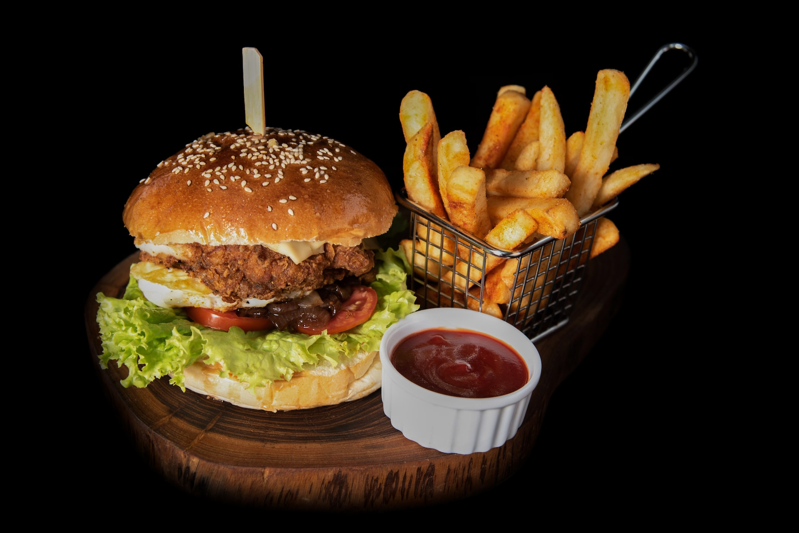
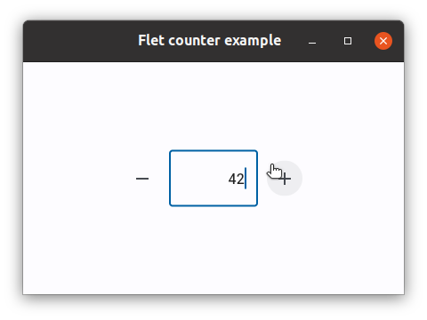
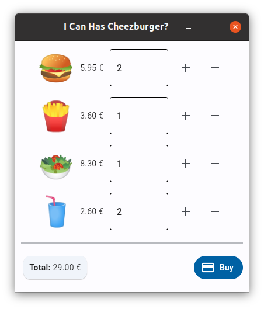

Au commencement ...
================================================================================

[Flet](https://flet.dev/) est une bibliothèque Python permettant de réaliser
des application graphiques. 

Mettez en oeuvre l'exemple donné dans [l'introduction de sa documentation](https://flet.dev/docs/) pour vous familiariser avec elle.




Architecture graphique
================================================================================

Développez l'architecture graphique d'une application de commande de
menu, représentée dans la figure ci-dessous :




Vous allez pour ce faire devoir explorer la documentation des 
[composants](https://flet.dev/docs/controls) proposés par flet.

Dans un premier temps :

  - Rien n'est "fonctionnel" dans votre interface: 
    toutes les valeurs numériques sont codées "en dur",
    il ne se passe rien quand on clique sur un bouton, etc.

  - Ne vous en faites pas si l'apparence de votre interface n'est pas exactement
    la même que celle donnée en exemple. Il sera toujours temps d'y revenir
    plus tard pour affiner cette représentation.

Vous pouvez utiliser <https://emojipedia.org/> pour trouvez les émojis dont
vous avez besoin (🍔 hamburger, 🍟 frites, etc.)

<details>
<summary>
**✨ Solution**
</summary>
```python
from flet import app, icons
from flet import MainAxisAlignment
from flet import (
    Card,
    Column,
    Container,
    Divider,
    FilledButton,
    IconButton,
    Markdown,
    Row,
    Text,
    TextField,
)


def main(page):
    page.title = "I Can Has Cheezburger?"
    page.window_width = 400
    page.window_height = 430
    page.add(
        Column(
            alignment=MainAxisAlignment.CENTER,
            controls=[
                Row(
                    [
                        Text("🍔", size=50),
                        Text("5.95 €"),
                        Container(
                            width=100,
                            content=TextField(
                                value="0", read_only=True
                            ),
                        ),
                        IconButton(icon=icons.ADD),
                        IconButton(icon=icons.REMOVE),
                    ],
                    alignment=MainAxisAlignment.CENTER,
                ),
                Row(
                    [
                        Text("🍟", size=50),
                        Text("3.60 €"),
                        Container(
                            width=100,
                            content=TextField(value="0"),
                        ),
                        IconButton(icon=icons.ADD),
                        IconButton(icon=icons.REMOVE),
                    ],
                    alignment=MainAxisAlignment.CENTER,
                ),
                Row(
                    [
                        Text("🥗", size=50),
                        Text("8.30 €"),
                        Container(
                            width=100,
                            content=TextField(value="0"),
                        ),
                        IconButton(icon=icons.ADD),
                        IconButton(icon=icons.REMOVE),
                    ],
                    alignment=MainAxisAlignment.CENTER,
                ),
                Row(
                    [
                        Text("🥤", size=50),
                        Text("2.60 €"),
                        Container(
                            width=100,
                            content=TextField(value="0"),
                        ),
                        IconButton(icon=icons.ADD),
                        IconButton(icon=icons.REMOVE),
                    ],
                    alignment=MainAxisAlignment.CENTER,
                ),
                Divider(),
                Row(
                    [
                        Card(
                            Container(
                                Markdown(
                                    "**TOTAL:** 0.00 €"
                                ),
                                padding=10,
                            )
                        ),
                        FilledButton(
                            text="Buy", icon=icons.PAYMENT
                        ),
                    ],
                    alignment=MainAxisAlignment.SPACE_BETWEEN,
                ),
            ],
        )
    )


app(target=main)
```
</details>


Composant sur mesure
================================================================================

La documentation de flet explique comment vous pouvez créer 
[vos propres composants](https://flet.dev/docs/guides/python/user-controls). 
Utilisée judicieusement, cette possibilité devait vous permettre
de rendre l'architecture de votre application de commande plus lisible.

Idéalement, on souhaiterait avoir un composant `Product` qui prend en charge
la représentation d'un produit, l'affichage de son prix ainsi que le comptage
du nombre d'unités que le client souhaite en commander. L'application qui
en résulte pourrait alors prendre la forme suivante :

```python
from flet import app, icons
from flet import MainAxisAlignment
from flet import (
    Card,
    Column,
    Container,
    Divider,
    FilledButton,
    IconButton,
    Markdown,
    Row,
    Text,
    TextField,
)

from product import Product


def main(page):
    page.title = "I Can Has Cheezburger?"
    page.window_width = 400
    page.window_height = 430
    page.add(
        Column(
            alignment=MainAxisAlignment.CENTER,
            controls=[
                Product("🍔", 5.95),
                Product("🍟", 3.60),
                Product("🥗", 8.30),
                Product("🥤", 2.60),
                Divider(),
                Row(
                    [
                        Card(
                            Container(
                                Markdown(
                                    "**TOTAL:** 0.00 €"
                                ),
                                padding=10,
                            )
                        ),
                        FilledButton(
                            text="Buy", icon=icons.PAYMENT
                        ),
                    ],
                    alignment=MainAxisAlignment.SPACE_BETWEEN,
                ),
            ],
        )
    )


app(target=main)
```

Développez une classe `Product` dans un fichier `product.py` pour faire en
sorte que cette nouveau programme fonctionne (comme précédemment).


<details>
<summary>
**✨ Solution**
</summary>

```python
from flet import icons
from flet import MainAxisAlignment
from flet import (
    IconButton,
    Container,
    Row,
    Text,
    TextField,
    UserControl,
)


class Product(UserControl):
    def __init__(self, emoji, price):
        super().__init__()
        self.price = price
        self.emoji = emoji

    def build(self):
        return Row(
            [
                Text(self.emoji, size=50),
                Text(f"{self.price:.2f} €"),
                Container(
                    width=100, content=TextField(value="0")
                ),
                IconButton(icon=icons.ADD),
                IconButton(icon=icons.REMOVE),
            ],
            alignment=MainAxisAlignment.CENTER,
        )
```
</details>


Composant localement fonctionel
================================================================================

Faites en sorte que les boutons `+` et `-` de votre composant `Product`
incrémentent et décrémentent la quantité du produit. Ne vous préocuppez
pas encore du total de la commande. Par contre, assurez-vous que la 
quantité d'unité commandée d'un produit ne puisse pas être négative.

<details>
<summary>
**✨ Solution**
</summary>

```python
from flet import icons
from flet import MainAxisAlignment
from flet import (
    IconButton,
    Container,
    Row,
    Text,
    TextField,
    UserControl,
)


class Product(UserControl):
    def __init__(self, emoji, price):
        super().__init__()
        self.price = price
        self.emoji = emoji
        self.quantity = 0

    def add_one(self, event):
        self.quantity += 1
        self.price_field.value = str(self.quantity)
        self.update()

    def remove_one(self, event):
        self.quantity -= 1
        self.quantity = max(self.quantity, 0)
        self.price_field.value = str(self.quantity)
        self.update()

    def build(self):
        more = IconButton(
            icon=icons.ADD, on_click=self.add_one
        )
        less = IconButton(
            icon=icons.REMOVE, on_click=self.remove_one
        )
        self.price_field = TextField(
            value=str(self.quantity), read_only=True
        )

        return Row(
            [
                Text(self.emoji, size=50),
                Text(f"{self.price:.2f} €"),
                Container(
                    width=100, content=self.price_field
                ),
                more,
                less,
            ],
            alignment=MainAxisAlignment.CENTER,
        )
```
</details>


Composant pleinement fonctionel
================================================================================

Il manque deux choses à notre composant produit :

  - Un attribut (ou une propriété) `total` qui permet de savoir
    combien le nombre d'unités choisi de ce composant va coûter.

    ```python
    hamburgers = Product("🍔", 5.95)
    hambugers.total  # 0.0 initially
    ```

  - Un "hook" (optionel) permettant de signaler à l'utilisateur du composant 
    que le nombre d'unités (et donc le coût) de ce produit a changé. 
    Ce hook prendra la forme d'une fonction de callback que l'on fournit 
    au produit lors de sa construction:
   
    ```python
    hamburgers = Product("🍔", 5.95, on_change=on_change)
    ```

Réalisez les changements nécessaires dans `product.py`. 

<details>
<summary>
**✨ Solution**
</summary>

```python
from flet import icons
from flet import MainAxisAlignment
from flet import (
    IconButton,
    Container,
    Row,
    Text,
    TextField,
    UserControl,
)


def do_nothing(event):
    pass


class Product(UserControl):
    def __init__(self, emoji, price, on_change=None):
        super().__init__()
        self.price = price
        self.emoji = emoji
        self.quantity = 0
        self.on_change = on_change or do_nothing

    def get_total(self):
        return self.price * self.quantity

    total = property(get_total)

    def add_one(self, event):
        self.quantity += 1
        self.price_field.value = str(self.quantity)
        self.on_change(event)
        self.update()

    def remove_one(self, event):
        self.quantity -= 1
        self.quantity = max(self.quantity, 0)
        self.price_field.value = str(self.quantity)
        self.on_change(event)
        self.update()

    def build(self):
        more = IconButton(
            icon=icons.ADD, on_click=self.add_one
        )
        less = IconButton(
            icon=icons.REMOVE, on_click=self.remove_one
        )
        self.price_field = TextField(
            value=str(self.quantity), read_only=True
        )

        return Row(
            [
                Text(self.emoji, size=50),
                Text(f"{self.price:.2f} €"),
                Container(
                    width=100, content=self.price_field
                ),
                more,
                less,
            ],
            alignment=MainAxisAlignment.CENTER,
        )
```
</details>

Intégration
================================================================================

Complétez votre application pour que le total de la commande soit toujours à jour.

<details>
<summary>
**✨ Solution**
</summary>

```python
from flet import app, icons
from flet import MainAxisAlignment
from flet import (
    Card,
    Column,
    Container,
    Divider,
    FilledButton,
    Markdown,
    Row,
)

from product import Product


def main(page):
    page.title = "I Can Has Cheezburger?"
    page.window_width = 400
    page.window_height = 430

    total_markdown = Markdown("**Total:** 0.0 €")

    def on_change(event):
        total = sum([p.total for p in products])
        total_markdown.value = f"**Total:** {total:.2f} €"
        page.update()

    products = [
        Product("🍔", 5.95, on_change=on_change),
        Product("🍟", 3.60, on_change=on_change),
        Product("🥗", 8.30, on_change=on_change),
        Product("🥤", 2.60, on_change=on_change),
    ]

    page.add(
        Column(
            alignment=MainAxisAlignment.CENTER,
            controls=[
                *products,
                Divider(),
                Row(
                    [
                        Card(
                            Container(
                                total_markdown, padding=10
                            )
                        ),
                        FilledButton(
                            text="Buy", icon=icons.PAYMENT
                        ),
                    ],
                    alignment=MainAxisAlignment.SPACE_BETWEEN,
                ),
            ],
        )
    )


app(target=main)
```
</details>