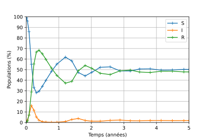
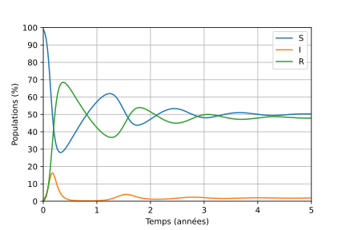

## Introduction

Le modèle épidémiologique à compartiments SIR détermine 
l'évolution dans le temps, parmi une population supposée constante de
$N$ individus, du nombre d'individus susceptibles d\'être infectés $S$,
du nombre d'individus infectés $I$ et du nombre d'individus en
rémission (n'ayant plus de symptômes cliniques) $R$ (cf. ["The SEIRS
model for infectious disease
dynamics"](https://www.nature.com/articles/s41592-020-0856-2) pour la
présentation d'un modèle plus complet).

Le paramètre $\beta>0$ représente le taux de contagion, $\gamma>0$ le
taux de guérison et $\omega>0$ le taux de perte d'immunité (ces
grandeurs sont homogènes à l'inverse d\'un temps). On définit le nombre
de reproduction de base $R_0$ par

$$
R_0 := \frac{\beta}{\gamma}
$$

En l\'absence de naissances et de morts, ces grandeurs évoluent selon
les équations :

$$
\dot{S}(t) = \omega R(t) - \beta \frac{I(t)S(t)}{N} 
$$

$$
\dot{I}(t) = \beta \frac{I(t)S(t)}{N} - \gamma  I(t) 
$$

$$
\dot{R}(t) = \gamma I(t) - \omega R(t)
$$


## Dépendances

Python 3, NumPy, SciPy, Matplotlib.

``` python
from numpy import *
from scipy.integrate import solve_ivp
import matplotlib.pyplot as plt
```

## Simulation


On définit les constantes

``` python
WEEK = 7
YEAR = 365
```

et

``` python
N = 100
beta = 1 / (WEEK)
gamma = 1 / (2 * WEEK)
omega = 1 / YEAR
```

#### 🚀 Simulation avec `solve_ivp`

Développer une fonction `dSIR` telle que le code 

``` python
S0, I0 = 99.0, 1.0
R0 = N - S0 - I0
t_span = [0.0, 5*YEAR]
results = solve_ivp(dSIR, t_span=t_span, y0=(S0, I0, R0))
```

fournisse les résultats d'une simulation du modèle SIR sur 5 ans 
avec une population initiale de 1 % de personnes infectées.

(Référence : 📖 [`solve_ivp`](https://docs.scipy.org/doc/scipy/reference/generated/scipy.integrate.solve_ivp.html))

#### ✨ Solution

::: collapse

``` python
def dSIR(t, SIR):
    S, I, R = SIR
    dS = omega * R - beta * I * S / N
    dI = beta * I * S / N - gamma * I
    dR = gamma * I - omega * R  
    return (dS, dI, dR)
```

Si vous êtes familier des fermetures,
et que la présence d'un argument `t` "qui ne sert à rien" vous titille,
vous pouvez également définir la fonction d'ordre supérieur

``` python
def autonomous(fx):
    def f_tx(t, x):
        return fx(x)
    return f_tx
```

et l'exploiter comme un décorateur pour définir `dSIR` sans le paramètre `t` :

``` python
@autonomous
def dSIR(SIR):
    S, I, R = SIR
    dS = omega * R - beta * I * S / N
    dI = beta * I * S / N - gamma * I
    dR = gamma * I - omega * R  
    return (dS, dI, dR)
```


:::

## Visualisation

#### 🚀 Visualisation des résultats

Développez une fonction `plot` à invoquer par :

``` python
plot(**results)
```

qui produise le graphique :



#### ✨ Solution

::: collapse

Les données dont nous avons besoin dans le dictionnaire `results` sont
associées aux clés `"t"` et `"y"`. Si elles étaient les seules données
présentes dans `results`, nous pourrions définir une fonction `plot`
de signature :

``` python
def plot(t, y):
    pass
```

et l'appel `plot(**results)` assignerait aux paramètres `t` et `y` les
données correspondantes de `result`. Mais en pratique, `results` contient
d'autre données :

``` python
>>> list(results.keys())
['t', 'y', 'sol', 't_events', 'y_events', 'nfev', ...]
```

Or à ce stade notre fonction n'accepte pas les paramètres nommés
`sol`, `t_events`, etc. L'appel à `plot` échoue donc logiquement :

``` python
>>> plot(**result)
Traceback (most recent call last):
...
TypeError: plot() got an unexpected keyword argument 'sol'
```

Une façon de changer cette situation est d'introduire un "ramasse-miettes", 
sous la forme d'un dictionnaire collectant les données de`result` qui ne sont 
pas associées aux clés `"t"` ou `"y"`. Pour ce faire, la notation `**` est
utilisée ; le dictionnaire associé est ici nommé `_` pour indiquer 
qu'on ne fera pas usage de son contenu (cela n'est pas obligatoire, juste
une convention).

``` python
def plot(t, y, **_):
    print(list(_.keys()))
```

``` python
>>> plot(**results)
['sol', 't_events', 'y_events', ...]
```

Avec cette technique, la fonction suivante fait l'affaire :

``` python
def plot(t, y, **_):
    plt.plot(t, y.T, "-+", label=["S", "I", "R"])
    plt.xlabel("Temps (années)")
    xlabels = [str(i) for i in range(5+1)]
    plt.xticks(arange(0, 5*YEAR+1, YEAR), xlabels)
    plt.ylabel("Populations (%)")
    plt.yticks(arange(0, 101, 10))
    plt.axis([0, 5*YEAR, 0, 100])
    plt.legend()
    plt.grid(True)
```

:::

## Configuration

Après examen de vos résultats préliminaires, les spécialistes de la dynamique
vous font par de réglages à effectuer sur la méthode du simulation.
Leurs préconisations prennent la forme d'un fichier `options.py` à
utiliser avec `solve_ivp` :

``` python
{
    "method": "Radau",
    "rtol": 1e-3,
    "atol": 1e-6
}
```

#### 🚀 Réglages

Prenez en compte le fichier d'options que l'on vous a donné.


#### ✨ Solution

::: collapse

``` python
options = eval(open("options.py").read())
results = solve_ivp(
    dSIR, 
    t_span=t_span, 
    y0=(S0, I0, R0), 
    **options
)
```


:::


## Temps continu

Lorsque `solve_ivp` est invoqué avec `dense_output=True`

``` python
results = solve_ivp(
    dSIR, 
    t_span=t_span, 
    y0=(S0, I0, R0), 
    dense_output=True
)
```

ses résultats comportent, en plus des données discrètes `t` et `y`,
une approximation de la solution comme une fonction du temps.

``` python
>>> sol = results["sol"]
```

Cette fonctionalité nous permet de réaliser une nouvelle version de
la fonction `plot`, telle que :

``` python
>>> t = arange(0, 5*YEAR) # a value every day for 5 years.
>>> plot(t, **results)
```

produise le graphique :




#### 🚀 Exploitation des "dense outputs"

Vérifier que `sol` est invocable, puis développer une nouvelle version de la
fonction `plot` exploitant les "dense outputs" de `solve_ivp` pour réaliser
le graphe voulu. 

#### ✨ Solution


::: collapse

``` python
>>> sol = results["sol"]
>>> sol
<scipy.integrate._ivp.common.OdeSolution at ...>
>>> callable(sol)
True
```

``` python
def plot(t_, sol, **_):
    plt.plot(t_, sol(t_).T, "-", label=["S", "I", "R"])
    plt.xlabel("Temps (années)")
    xlabels = [str(i) for i in range(5+1)]
    plt.xticks(arange(0, 5*YEAR+1, YEAR), xlabels)
    plt.ylabel("Populations (%)")
    plt.yticks(arange(0, 101, 10))
    plt.axis([0, 5*YEAR, 0, 100])
    plt.legend()
    plt.grid(True)
```

:::

## Evènements

#### 🚀 Seuils d'infection

Utiliser le paramètre `events` de `solve_ivp` pour détecter les instants
où le nombre d'infectés passe en-dessous ou au-dessus de 10 %. 
Adapter une nouvelle fois la fonction `plot` pour représenter ces évènements
comme des points noirs sur la courbe associée à la variable $I$.


Comment réorganiser votre programme pour prendre en charge facilement un
seuil d'infection arbitraire et non pas fixe à 10 % ?

#### ✨ Solution

::: collapse

``` python
def event(t, SIR):
    S, I, R = SIR
    return I - 10.0
```

``` python
results = solve_ivp(
    dSIR, 
    y0=(S0, I0, R0), 
    t_span=t_span, 
    dense_output=True, 
    events=[event]
)
```

``` python
def plot(t_, sol, t_events, **_):
    plt.plot(t_, sol(t_).T, "-", label=["S", "I", "R"])
    t_event = t_events[0]
    plt.plot(t_event, sol(t_event)[1], "k.")
    plt.xlabel("Temps (années)")
    xlabels = [str(i) for i in range(5+1)]
    plt.xticks(arange(0, 5*YEAR+1, YEAR), xlabels)
    plt.ylabel("Populations (%)")
    plt.yticks(arange(0, 101, 10))
    plt.axis([0, 5*YEAR, 0, 100])
    plt.legend()
    plt.grid(True)
```

La solution "évidente" pour prendre en charge une seuil limite qui peut varier
est d'utiliser une variable globale :

``` python
I_max = 2.0

def event(t, SIR):
    S, I, R = SIR
    return I - I_max
```

L'avantage est que le code appelant la simulation est inchangé :

``` python
results = solve_ivp(
    dSIR, 
    y0=(S0, I0, R0), 
    t_span=t_span, 
    dense_output=True, 
    events=[event]
)
```

``` python
>>> plot(t, **results)
```


Si vous n'aimez pas beaucoup les variables globales, vous pouvez les éviter
en utilisant une fonction d'ordre supérieur qui renvoie une fonction `event` :

``` python
def I_crosses(I_threshold):
    def event(t, SIR):
        S, I, R = SIR
        return I - I_threshold
    return event
```

Vous l'exploitez alors de la façon suivante :

``` python
results = solve_ivp(
    dSIR, 
    y0=(S0, I0, R0), 
    t_span=t_span, 
    dense_output=True, 
    events=[I_crosses(2.0)]
)
```

avec les même résultats que précédemment

:::


## Génération de dynamique


Vous avez sans doute remarqué que la dynamique du modèle SIR est entièrement
déterminée par les flux existant entre les "compartiments" de population
$S$, $I$ et $R$, qui peuvent être décrits par la structure :

``` python
SIR_dynamics = {
 ("S", "I"): "beta * I * S / N",
 ("I", "R"): "gamma * I",
 ("R", "S"): "omega * R"
}
```

Au lieu d'écrire "à la main" la fonction `dSIR` comme précédemment, 
on peut définir une fonction `make_d_state` qui prend comme argument
le type de dictionnaire ci-dessus et produit automatiquement la fonction
`dSIR_auto`[^why] :

[^why]: On peut ainsi éviter les erreurs dans la traduction du modèle de 
flux en équations différentielles, définir plus rapidement de nouveaux
modèles compartimentaux, etc.

``` python
dSIR_manu = dSIR
dSIR_auto = make_dstate(SIR_dynamics)
```

#### 🚀 Création du champ de vecteurs de la dynamique

Implémenter la fonction `make_dstate`. 
On vérifiera que les comportements de la version manuelle et automatique sont
identiques. Par exemple :

``` python
>>> dSIR_manu(0.0, (1/3, 1/3, 1/3))
(0.0007545118504022613, -0.023650793650793648, 0.02289628180039139)
>>> dSIR_auto(0.0, (1/3, 1/3, 1/3))
(0.0007545118504022613, -0.023650793650793648, 0.02289628180039139)
```

#### ✨ Solution

::: collapse

``` python
def get_vars(dynamics):
    vars = []
    for pair in dynamics.keys():
        vars.extend(pair)
    # remove duplicated vars
    return list(set(vars))
```

``` python
>>> get_vars(SIR_dynamics)
['S', 'I', 'R']
```

``` python
def make_dstate(dynamics):
    vars = get_vars(dynamics)
    
    def fun(t, state):
        ns = globals().copy()
        for var, value in zip(vars, state):
            ns[var] = value
        dstate = []
        for var in vars:
            d = 0
            for (edge, expr) in dynamics.items():
                source, target = edge
                if source == var:
                    d -= eval(expr, ns)
                if target == var:
                    d += eval(expr, ns)
            dstate.append(d)
        return dstate
        
    return fun 
```

:::
